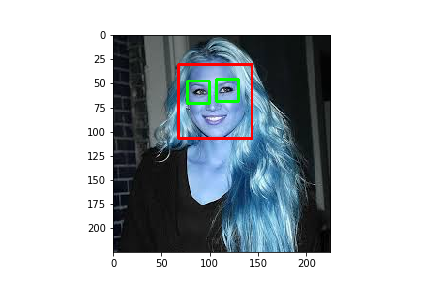

# Image_Classifications_With_OpenCV
For this Data Science project I have used OpenCV python  for image classification.

## Data
For this project, I have made my own dataset by scraping google image using the [Fatkun Batch Download Image](https://chrome.google.com/webstore/detail/fatkun-batch-download-ima/nnjjahlikiabnchcpehcpkdeckfgnohf?hl=en) chrome extention.

## Objective: 
In this project, I have built a image classsifier to itentify the image of female tennis players.

**Steps:**
   1. Get Data: We need data to train our model. 
   2. Prepare Data: Clean, normalize, and get data in a form that we can feed into our model
   3. Train Model: Trained data using Support Vector Classification(SVC), Logistic Regression, and Random Forest Classification
   4. Evaluate model performance
   5. Parameter tuning.
   
  
